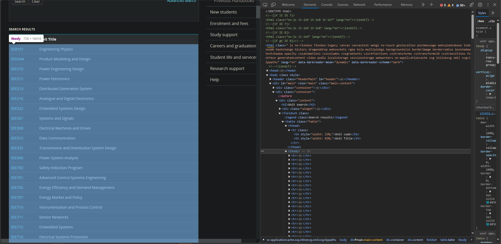

Things to do:
- Inspect the data structure of the handbook webpage
- Download the webpages for a small subset of units at first
- Download webpages for all units

### Sources
Web scraping tutorial: https://realpython.com/beautiful-soup-web-scraper-python/#step-1-inspect-your-data-source 
Web scraping tutorial: https://www.scrapingbee.com/blog/web-scraping-101-with-python/
Deakin University 2023 handbook: https://www.deakin.edu.au/students/enrolment-and-fees/manage-your-course/handbooks/2023-handbook
Beautiful soup docs: https://www.crummy.com/software/BeautifulSoup/bs4/doc/

### Logs
- 2023-09-21 
 - 1439: Researching how to do web scraping in Python
 - 1444: Looking through handbook page structure 
 - 

### Notes
"Beautiful Soup transforms a complex HTML document into a complex tree of Python objects. But you’ll only ever have to deal with about four kinds of objects: Tag, NavigableString, BeautifulSoup, and Comment."